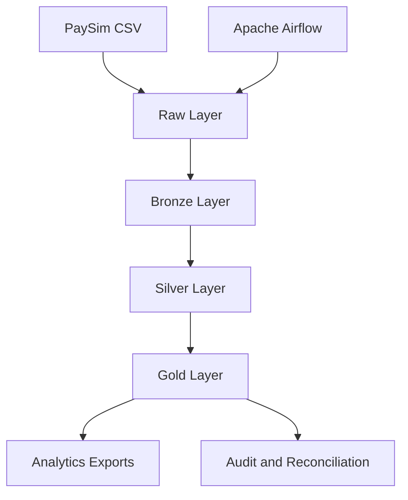

# PaySim Financial Data Pipeline

An end-to-end financial transaction data pipeline built with PySpark. The project processes PaySim transactions through a medallion architecture, produces fraud-monitoring and analytical datasets, performs automated data-quality checks, and supports reproducible execution with Docker and Apache Airflow.

## Project Overview

The pipeline transforms raw mobile-money transaction data into validated, analysis-ready datasets.

It demonstrates practical data-engineering concepts including:

- modular ETL development with Python and PySpark;
- Raw, Bronze, Silver, and Gold data layers;
- schema enforcement and data-quality validation;
- transaction and fraud analytics;
- pipeline auditing and reconciliation;
- automated testing with `pytest`;
- containerized execution with Docker;
- workflow orchestration with Apache Airflow.

## Architecture



### Data layers

- **Raw:** Original PaySim transaction data.
- **Bronze:** Ingested records with standardized schema and pipeline metadata.
- **Silver:** Cleaned, validated, and enriched transactions.
- **Gold:** Aggregated datasets for transaction analysis, fraud monitoring, and reporting.
- **Audit:** Run-level metrics, validation results, and reconciliation status.

## Pipeline Workflow

1. Validate the source dataset.
2. Initialize the Spark session and pipeline configuration.
3. Ingest transactions into the Bronze layer.
4. Clean and enrich records in the Silver layer.
5. Generate Gold-level analytical datasets.
6. Export reporting-friendly CSV summaries.
7. Reconcile record counts and transaction amounts.
8. Write pipeline audit and execution-summary files.

## Gold Outputs

The pipeline generates outputs such as:

- daily transaction summaries;
- daily transaction-type summaries;
- transaction-type performance summaries;
- fraud-monitoring data;
- hourly fraud summaries;
- high-value transaction summaries;
- Gold table registry;
- pipeline audit results;
- pipeline execution summaries.

## Data Quality and Reconciliation

Validation checks include:

- required-column validation;
- schema and data-type enforcement;
- null and duplicate checks;
- transaction-value validation;
- fraud-indicator validation;
- record-count reconciliation;
- transaction-amount reconciliation;
- output-file validation;
- overall pipeline success and reconciliation status.

A successful execution produces:

```text
pipeline_status = SUCCESS
overall_reconciliation_status = PASS
```

## Airflow Orchestration

The Airflow DAG coordinates pipeline execution through four tasks:


The DAG is configured for manual execution so each run can be monitored through the Airflow interface.

## Technology Stack

- Python
- PySpark
- Pandas
- Apache Airflow
- Docker and Docker Compose
- Pytest
- CSV-based analytical exports

## Repository Structure

```text
paysim-financial-data-pipeline/
├── airflow/
│   ├── config/
│   ├── dags/
│   │   └── paysim_pipeline_dag.py
│   ├── logs/
│   └── plugins/
├── config/
├── data/
│   ├── raw/
│   ├── bronze/
│   ├── silver/
│   └── gold/
├── docs/
├── logs/
├── notebooks/
├── scripts/
├── src/
│   └── paysim_pipeline/
├── tests/
├── compose.yaml
├── compose.airflow.yaml
├── Dockerfile
├── Dockerfile.airflow
├── pytest.ini
├── requirements.txt
└── requirements-airflow.txt
```

Generated datasets, runtime logs, temporary Spark files, and the complete raw dataset are excluded from version control.

## Dataset

This project uses the **PaySim synthetic financial transaction dataset**, which simulates mobile-money transactions and includes both legitimate and fraudulent activity.

The complete dataset is not stored in this repository because of its size. Download it separately and place the CSV at:

```text
data/raw/PS_20174392719_1491204439457_log.csv
```

## Running Locally

### Prerequisites

- Python 3.12 or a compatible version
- Java
- Apache Spark or PySpark
- Docker Desktop, for containerized execution

### Create a virtual environment

```powershell
python -m venv .venv
.\.venv\Scripts\Activate.ps1
python -m pip install -r requirements.txt
```

### Run the automated tests

```powershell
pytest
```

### Run the pipeline

```powershell
python -m paysim_pipeline.main `
  --input data/raw/PS_20174392719_1491204439457_log.csv `
  --spark-master "local[4]" `
  --driver-memory 6g `
  --shuffle-partitions 64 `
  --high-value-threshold 200000 `
  --approx-distinct-rsd 0.05 `
  --clear-summary-outputs `
  --log-level INFO
```

## Running with Docker

Build and run the standalone pipeline:

```powershell
docker compose up --build
```

The project directories are mounted into the container so generated outputs remain accessible from the local machine.

## Running with Airflow

Build and start the Airflow environment:

```powershell
docker compose `
  -f compose.airflow.yaml `
  up `
  -d `
  --build
```

Open the Airflow interface:

```text
http://localhost:8080
```

Trigger the following DAG:

```text
paysim_financial_data_pipeline
```

Stop Airflow without deleting its metadata:

```powershell
docker compose `
  -f compose.airflow.yaml `
  down
```

## Engineering Decisions

- **PySpark** supports scalable distributed transformations.
- **Medallion architecture** separates ingestion, cleaning, and analytical processing.
- **Modular pipeline code** keeps transformation logic reusable and testable.
- **Reconciliation checks** verify that records and amounts remain consistent across layers.
- **Docker** provides a reproducible runtime with the required Java and Spark dependencies.
- **Airflow** separates workflow orchestration from transformation logic.
- **CSV exports** make final summaries easy to inspect and use in reporting tools.

## Current Scope

This is a local portfolio implementation designed to demonstrate production-oriented data-engineering practices. It does not process real customer or banking information.

Potential extensions include:

- object storage such as Amazon S3 or Azure Data Lake Storage;
- Parquet or Delta Lake storage;
- PostgreSQL or a cloud data warehouse;
- automated CI testing with GitHub Actions;
- data-quality frameworks and monitoring dashboards;
- Kubernetes-based deployment;
- incremental ingestion and partitioned processing.

## Author

**Sai Sidharth Manikandan**

MS in Statistics, Florida State University  
Data Engineering, Data Science, and Applied Analytics
